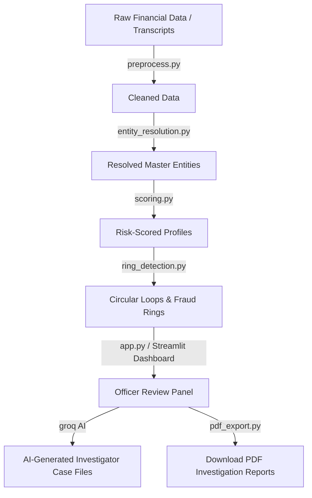

#  Shaheen-Eye | Pakistan Financial Intelligence Suite (P-FIS) v1.0

> **Federal Board of Revenue (FBR) — Intelligence & Investigation Wing**  
> **Financial Monitoring Unit (FMU) — Government of Pakistan**  
> **CLASSIFICATION: CONFIDENTIAL · AUTHORIZED PERSONNEL ACCESS ONLY**

---

##  Project Overview

**Shaheen-Eye (P-FIS)** is a premium, secure financial intelligence and compliance audit suite designed for tax evasion detection, shell company auditing, money laundering tracking, and fraud ring identification. The tool ingests financial transcripts, resolves duplicate identities, scores risk vectors, detects circular transaction loops, and generates detailed audit files.

---

##  System Architecture & Workflow

The platform follows a multi-stage data processing pipeline:



---

##  Role-Based Access Control (RBAC)

The dashboard enforces strict credentials authentication based on officer duties:

| Role | Access Level | Responsibilities | Default Password |
|---|---|---|---|
| **Field Investigator** | Limited Access | General case review, profile investigation, local entity resolution. | `shaheen123` |
| **Senior Analyst** | Elevated Access | Graph visualizations, ring detections, AI case summaries, and risk score overrides. | `shaheen123` |
| **Director IIW** | Full Access | Exporting overall reports, system audit log tracking, and session saving/restoring. | `shaheen123` |

---

##  Core Modules

1. **[preprocess.py](file:///D:/Projects/Shaheen-Eye/preprocess.py) (Data Preprocessing):** Standardizes NTNs, CNICs, entity names, and transactions.
2. **[entity_resolution.py](file:///D:/Projects/Shaheen-Eye/entity_resolution.py) (Entity Linkage):** Resolves duplicate entities across data feeds using `splink` and `rapidfuzz` string similarity distance.
3. **[scoring.py](file:///D:/Projects/Shaheen-Eye/scoring.py) (Risk Assessment):** Calculates transaction anomalies, shell indicators, tax gaps, and historical compliance violations.
4. **[ring_detection.py](file:///D:/Projects/Shaheen-Eye/ring_detection.py) (Network Analysis):** Runs depth-first searches (DFS) and cycle-finding algorithms on transactional networks to identify circular funding and tax fraud syndicates.
5. **[pdf_export.py](file:///D:/Projects/Shaheen-Eye/pdf_export.py) (PDF Exporter):** Packages case details, metrics, and transaction graphs into formal, printable intelligence folders.

---

##  Quick Start & Local Run

### Prerequisites
* Python 3.10+
* Groq API Key (optional, for AI summaries)

### Setup & Launch

1. **Clone & Navigate:**
   ```bash
   git clone https://github.com/al-nusrati/Shaheen_Eye.git
   cd Shaheen_Eye
   ```

2. **Configure Environment Variables:**
   Create a `.env` file in the root directory:
   ```env
   GROQ_API_KEY="your-groq-api-key-here"
   PFIS_INV_PASSWORD="shaheen123"
   PFIS_ANALYST_PASSWORD="shaheen123"
   PFIS_DIRECTOR_PASSWORD="shaheen123"
   ```

3. **Install Dependencies:**
   ```bash
   pip install -r requirements.txt
   ```

4. **Run Mock Data Generator (Optional):**
   If you need to generate sample transactional and entity datasets for testing:
   ```bash
   python generate_data.py
   python generate_extra_data.py
   ```

5. **Start Streamlit Dashboard:**
   ```bash
   streamlit run app.py
   ```

6. Access the dashboard via **[http://localhost:8501](http://localhost:8501)**.
